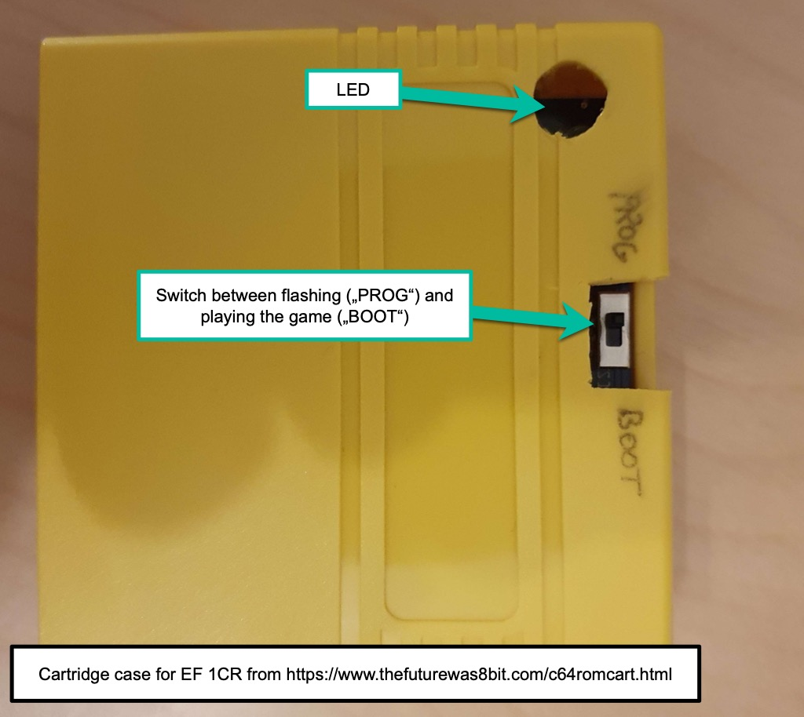

## Overview of compatible cartridges

A majority of C64 cartridges works with the C64 Core on MEGA65 - both as physical hardware as well as software-mounted images. Some very specific cartridge tricks do not work, like the Kernal Replacement function developed by **skoe** for the EasyFlash 3 and also used in other cartridges. Details about specific cartridges can be found below.

The MEGA65 will autostart the C64 core when a C64 cartridge is inserted before turning on the MEGA65. This behaviour can be turned off. Please check the MEGA65 documentation for this as it is not a function of the C64 core.

## Important safety tips

Two very important rules to follow:

**Never put cartridges into the cartridge slot (or pull them out) while the MEGA65 is turned on.** This can just crash the machine and in the worst case damage either the cartridge or the MEGA65.

**Avoid cartridges that do not have a proper case.** In the past years a lot of beautiful vanity cartridges that show game artwork or christmas decorations, as well as cheap EasyFlash3 or KungFuFlash cartridges, all without a proper plastic case around them, are used by enthusiasts. While beautiful, these can potentially damage your MEGA65. They might not be inserted straight, metal objects or fluid drops might fall onto the cartridge and create short circuits or they could break the cartridge slot if something falls on them or they are pulled up instead of out. While it is tempting to just use them without a case, replacing a damaged MEGA65 is expensive and, depending on availablity, might take a long time, so take no risks here, please. _At least do not say we did not warn you._

Two sources for cartridge cases are:

[The Future was 8BIT](https://www.thefuturewas8bit.com/c64romcart.html)

[Protoparts](https://www.protoparts.at/product-category/gehaeuse/)

## MEGA65 revisions and compatibility

The 2024 revision (R6) of the MEGA65 is fully compatbile with the C64 hardware specification, as it features bi-directional signals for RESET, IRQ and NMI. Machines built before 2024 (R3) do not have bi-directional RESET which unfortunately makes some freezer cartridges as well as the RESET function of KungFuFlash incompatible.

The 5.1 version of the C64 core does not yet support bi-directional IRQ/NMI. Due to this, some specific cartridges as well as the Kernal Replacement function of the EasyFlash 3 cartridge do not work yet.

Learn more about [different MEGA65 revisions here](installation.html#differences-between-mega65-revisions).

### CORE #0 update for older MEGA65
If your MEGA65 was built before 2024 and you did not update the system software, then you very likely need to update your so-called CORE #0. This is the MEGA65 core that decides which core is supposed to run when a cartridge is inserted. The original CORE #0 crashed when so-called "Ultimax mode" cartridges were inserted and therefore a lot of the games, utility cartridges and flash cartridges cannot be started when this old CORE #0 is installed.

If you see such crashes, [update CORE #0 as described here](https://mega65.atlassian.net/l/cp/1fkp5zvQ).

## Physical versus mounted cartridges

Why would you actually want a physical cartridge when the Core allows to "mount" a cartridge virtually by selecting a `.crt` file you have stored on your SD card?
1. To support developers and publishers
2. For 100% compatiblity
3. To save data
4. To use Freezer Functions

### Support Developers and Publishers

Over 40 years after its release, companies like [Protovision](https://www.protovision.games) and
[RGCD](https://rgcd.bigcartel.com/products) are still producing new games as commercial software. Buy as many original hardware cartridges from them as you can  afford. The Commodore 64 community needs to stay alive.

But sometimes the cartridges are just sold out or a friendly soul has released a new game in cartridge format that you can download on itch.io. You do not need to burn an EPROM or flash a cartridge, but can mount those `.crt` files in the Core.

### Compatibility issues

The current implementation of the Core uses the MEGA65 HyperRAM to store the visible bank of ROM data when you use a `.crt` file. So there is a very small time delay when a bank switch occurs because we need to halt the C64 for a very short time while loading the new bank data into HyperRAM. On real hardware cartridges, this switch is instantaneous. While during testing we have not found any cartridge that has serious issues with that small delay, there always is the chance that you see a glitch or any other side effect.

### Save Data

Some cartridge types (EasyFlash 1&3, GMod 2) allow to write data back to the cartridge. This is not supported by mounted `.crt` files. In other words: If you save your game on a mounted software cartridge it is lost as soon as you reset because this will not be saved to the SD card. On real physical cartridges save is supported.

### Freezer cartridges

The MEGA65 core has no internal freezer functionality (especially because it can not create new files) but also has **very limited support** for virtual cartridge buttons either. Basically, the <kbd>Restore</kbd> key can be used with SOME freezers. During testing we only had limited success with the Final Cartridge III loaded as a `.crt` file.

Physical freezer cartridges do work, but we recommend also using an external drive (or SD2IEC or similar), because the Core can not create new files on your SD card so if you do not have a mountable disk to save to, your freeze can not be saved.

## Specific *physical* cartridge compatibility

This section is specific to hardware cartridges that you insert into the cartridge slot. For compatibility when mounted as a `.crt` file from an SD-Card, please see the next major section.

### C64GS Cartridges
Cartridges produced for the C64GS console work, but some cartridges as a copy protection require the Kernal to be set to "Games System", otherwise they will just show a black screen. This would happen on a real C64 too. You can switch the Kernel in the main menu as described [here](the-main-menu.html#kernal-standard).

### EasyFlash 1 and EasyFlash 1CR
The original EasyFlash (aka EasyFlash 1) and the cost reduced
[EasyFlash 1CR](https://www.freepascal.org/~daniel/easyflash/)
are among the most popular cartridges in the C64 scene. Many new games and demo or utility releases come in the EasyFlash cartridge format.

What makes EasyFlash special is that it can be programmed from the C64 itself without an EPROM burner and that it can be erased and programmed with a different program several thousand times. This process is called *flashing*.

**The C64 Core does support flashing from inside the Core if you have a physical cartridge.**

Since the original EasyFlash 1 is hard to find these days, we will focus on the
[EasyFlash 1CR](https://www.freepascal.org/~daniel/easyflash/)
by Dani&euml;l Mantione. This handy cartridge is officially and proactively
supported by the C64 for MEGA65 core development team, so this is your number
one go to Flash Cartridge. Buy it
[here](https://www.freepascal.org/~daniel/easyflash/)
by filling out Dani&euml;l's form. Scroll down to the bottom of his web page
to find an order form. Here are some important considerations:

* Use the field where you specify your postal address to add the comment that you want a so called "Through Hole" version of the cartridge and **not** the so called "SMD" version of the cartridge. Only the "Through Hole" version is supported on the MEGA65 at this time. (This might change in the future.)
* We highly recommend that you buy fully assembled cartridges to ensure that they actually work in your MEGA65.
* You need a case for the cartridge. The easiest way to obtain one is to order it from Dani&euml;l's website together with your Easy Flash 1CR.

#### Flashing the first game

Conveniently, the Easy Flash 1CR comes with a preinstalled flasher: When you
insert the cartridge into your MEGA65's Expansion Port and start the machine
then you will see the EasyFlash program's start screen and you will
imediatelly be able to flash the `*.crt` file as
[described here](https://skoe.de/easyflash/writecrt/). If you don't have a
[SD2IEC](https://www.ncsystems.eu/)
or something similar, then you will likely need to split large `*.crt` files
into multiple `*.d64` images using
[EasySplit](http://skoe.de/easyflash/splitfiles/). Watch this
[YouTube video](https://youtu.be/jD-RmB6YzXc)
to learn how the flashing on the MEGA65 works when you have split the `*.crt`
files into multiple `*.d64` files.

#### Adjusting the case for being able to re-flash any time

After you flashed the EF 1CR for the first time, the built-in flasher is gone
and replaced by the game you flashed. If you want to re-flash at a later stage
you need to either use a screwdriver, open the case, move the switch to the
PROG position, close the case again, start the MEGA65 while the cartridge
is inserted, re-flash using
[preferably this version of EasyProg](https://github.com/MJoergen/C64MEGA65/raw/master/doc/assets/easyprog-dm.prg),
open the cartridge case with a screwdriver again, move the switch back to the
BOOT position, close the case again and you are good to go.

As this is obviously a onerous workflow, we recommend that you cut or drill
some holes into the EF 1CR's case. Here are two examples from the MEGA65
team:

| Lydon's Example                  | sy2002's Example                  |
|----------------------------------|-----------------------------------|
|  |  |

[This version of EasyProg](https://github.com/MJoergen/C64MEGA65/raw/master/doc/assets/easyprog-dm.prg)
is from the creator of the EF 1CR and is recommended for re-flashing the
EF 1CR. You can also use
[EasyProg 1.8.1 or newer](https://github.com/KimJorgensen/easyflash/releases).

### EasyFlash 3

The EasyFlash 3 (short: EF3) is quite a beast: It sports seven 1 MB slots for game and application cartridges. Each of these slots represents a full-featured EF1 cartridge. The EF3 can also run freezer cartridge images such as Action Replay, Retro Replay, Nordic Power / Atomic Power and Super Snapshot 5. Learn more [here](http://skoe.de/easyflash/ef3intro/).

**IMPORTANT: The C64 for MEGA65 core is not yet supporting all features of the
EF3, so read the following information carefully.**

#### Using EasyFlash 3

1. Insert the EF3 into the Expansion Port and turn on your MEGA65. You will see the EF3's menu (if your MEGA65 autoboots the C64 core when a C64 cartridge is inserted).
2. Press <kbd>K</kbd> while you are in the EF3's menu to kill the cartridge and go back to the C64's BASIC.
3. Return back to the EF3's menu any time by pressing the MEGA65's <kbd>Reset</kbd> button.
4. Flash up to seven EasyFlash 1 compatible standard slots and up to two Freezer slots using the built-in flasher. We strongly recommend a large IEC device like an SD2IEC connected to the IEC bus. Otherwise you have to split every item you want to flash onto several `.d64` files or physical discs. 
5. To do so, press <kbd>P</kbd> while you are in the EF3's start menu to start EasyProg. You can flash multiple slots (one after the other) while EasyProg is running. Make sure that you enter meaningful names for the slots when being prompted by EasyProg.
6. Play games by pressing a letter between <kbd>A</kbd> and <kbd>F</kbd> or start freezers by pressing <kbd>R</kbd>, <kbd>Y</kbd> or <kbd>S</kbd>.

Instead of using the keys mentioned above, you can also navigate the menu
using a joystick in port #2 or by using the cursor keys and <kbd>Return</kbd>.
Press <kbd>Space</kbd> to switch back and forth between the different pages
of the EF3's main menu.

#### Using freezers on EF3

The <kbd>Special</kbd> button of the EF3 works as the "freeze" button of the
selected freezer cartridge.

The following freezers are tested and working. Download their binaries from [rr.pokefinder.org](https://rr.pokefinder.org/) as these binaries are known to work. **Always make sure that you flash the `.bin` version of the freezer and not the .crt**

* [Action Replay](https://rr.pokefinder.org/wiki/Category:Action_Replay)
* [Nordic Power / Atomic Power](https://rr.pokefinder.org/wiki/Nordic_Power)
* [Super Snapshot 5](https://rr.pokefinder.org/wiki/Super_Snapshot) (only use the original Kernel; JiffyDOS and it's modifications seem to cause problems)

_With the modified firmware for EasyFlash3 from Kim Jorgenson you can also install Final Cartridge III type freezers. These also seem to work but have not been tested fully. For this specific modification of the EasyFlash3 please checkout https://github.com/KimJorgensen/easyflash._

The [Retro Replay](https://rr.pokefinder.org/wiki/Retro_Replay) is not working on the Core.

#### Pre-2024 (R3) MEGA65 limitations

On early MEGA65 revisions produced before 2024 (R3), the buttons on cartridges do not work as expected. <kbd>Reset</kbd> Buttons do not work at all. <kbd>Menu</kbd> Buttons do not work, but their function usually is provided when pressing the Reset-Button of the MEGA65. The <kbd>Special</kbd> button that usually is the Freeze button with freezer cartridges does work partially only. It for example does not bring you back to BASIC ("Kill the cartridge") when in the EF3 menu. Use the <kbd>K</kbd> instead to go back to BASIC.

#### Kernal replacement is not supported

Thomas "skoe" Giesel found a clever hardware hack that allows a cartridge to replace the KERNEL ROM of the C64. This usually is not possible and uses tricky timing.

On the R3 machine it is technically impossible to replicate this timing. To make sure you do not damage anything, Kernal Mode on EF3 is disabled.

While the technical limitation on the R6 machines (2024+) has been removed, the 5.1 version of the Core does not support the timing yet. We are planning this as a feature for later versions and until then, Kernal Mode on EF3 is not working. If you select a Kernal, the Core will boot the Kernal set in the Core menu instead and NOT the one on the EF3.

### Kung Fu Flash

[Kung Fu Flash](https://github.com/KimJorgensen/KungFuFlash) (short: KFF) can emulate different cartridge types in `.crt`-format , load `.prg` files and use `.d64` disk images. Just place your desired files on a FAT formatted microSD card for the KFF and use the built-in launcher to execute them.

Once a cartrige has been selected, it will be active until changed and will even survive powering off your MEGA65. If you turn it on again, the last selected cartridge (or program) will boot. Please check out the Kung Fu Flash documentation at:

https://github.com/KimJorgensen/KungFuFlash

You might sometimes experience glitches when running demanding software, so in theory it is fair to say the EF1 or the EF3 are slightly more compatible with the C64 CORE for MEGA65.

But it is also important to mention that KFF induced glitches seem to be very rare: We tested very demanding games with the KFF such as "Eye of the Beholder", "A Pig Quest" and "Prince of Persia" and none of these games showed any glitches. Overall, the KFF works great with the C64 for MEGA65.

#### Using KFF with pre-2024 (R3) MEGA65

Because the R3 revision of the MEGA65 does not have full bi-directional signals on the bus, you need some workarounds to fully use the KFF.

**Always press the KFF's buttons in parallel with the MEGA65's <kbd>Reset</kbd> button.**

1. To enter the KFF's menu, press <kbd>MEGA65 Reset</kbd> plus <kbd>KFF Menu</kbd>. From here you can flash cartriges, programs or tape images to the KFF.
2. To start a game, press <kbd>MEGA65 Reset</kbd> plus <kbd>KFF Special</kbd>.
3. After you loaded a cartridge, program or tape in step (1), you need to explicitly perform step (2) - autostart does not work.
4. When you switch on your MEGA65 while the KFF is inserted into the Expansion Port, then the system initially crashes. Don't worry, this is "normal". Now decide whether you want to enter the menu, then perform step (1) or if you want to start the game, then perform step (2).
5. The KFF's <kbd>Reset</kbd> button does not work at all. The reason is that the
MEGA65's R3 and R3A board's electronic cannot sense the reset signal of any
cartridge inserted into the Expansion Port.

#### Freezer Cartridges on Kung Fu Flash

**If you have a Pre-2024 (R3) MEGA65, Freezer Cartridges will not work at all**

On the R6 board, we have tested some freezer cartridges and most will work. Please be advised that in order to SAVE a freeze, you need either a mounted empty `.d64` image or a physical drive. The C64 Core can not create new images for you, it can only work with what is already on the SD-Card.

### Final Cartridge III

When you insert a Final Cartridge III (short: FCIII) into the MEGA65's Expansion Port and switch-on the machine then you will encounter one of two situations instead of being greeted with the FCIII's main menu:

* You will land in BASIC
* You will see a "blue screen", i.e. the standard C64 background and frame color, but without anything readable or garbage on it

To start the Final Cartridge you need to perform the following three workaround steps one or multiple times in a row:

1. Press the <kbd>Reset</kbd> button of the FCIII
2. Wait one second
3. Press the <kbd>Reset</kbd> button of the MEGA65

After the FCIII started properly, mostly everything works fine, including the fast loader and the <kbd>Freezer</kbd> button (at least most of the time).

Please note that the Final Cartridge III monitor does NOT let you jump back into a running program. This has been reported as a bug, but it actually is a technical limitation of FCIII. When you enter the monitor from the freezer, no version of Final Cartridge III on any hardware allows jumping back into the game. When you exit the monitor, you will get to "READY." instead.

### GeoRAM

GeoRAM cartridges work. Make sure that you use a GEOS boot disk with support for GeoRAM. Here are two locations where you can download such boot disks:

* [commodore.software](https://commodore.software/downloads/download/690-geos-operating-system/11807-geos-2-0-georam-support)
* [www.lyonlabs.org](https://www.lyonlabs.org/commodore/onrequest/geos/index.html)

### REU 1700, 1764, 1750
You can not use physical REU cartridges with the Core on the MEGA65.

You can activate a virtual REU 1750 in the menu. This deactivates the physical cartridge slot and the simulated cartride, so the virtual REU 1750 can not be combined with any other cartridge.

### Other Cartridges tested and working

All regular **game cartridges** we have tested are working fully. You can find a complete test protocol on https://github.com/MJoergen/C64MEGA65/blob/master/tests/carts.md

With the clear exception of buttons not working fully on R3 machines (see above), the following physical hardware cartridges have been tested and to our best knowledge work:

* Action Replay
* Epyx Fast Load
* PowerCartridge
* Super Snapshot

### Untested Cartridges

The following cartridges have not been tested and should be considered **NOT WORKING**.

* **TeensyROM** - currently in testing but unexpected to fully work before the next Core version.
* **Sidekick64** - currently in testing but unexpected to fully work before the next Core version.
* **1541 Ultimate-II and variations** - _we expect these to not work_ due to the Kernal Replacement functions that are currently imcompatible with the 5.1 core as well as the REU functionality incompatible with the Core.
* **GMod2** - we have not tested _flashing_ these cartridges including initial flash with the bootloader included when buying them empty in bulk but they SHOULD work.
* **CMD RAM-Link, IEEE-488, Magic Voice, MMC64, IDE64** - these cartridges expand the C64 with further storage options or speech output and are currently not supported.
* **Expert Cartridge** - this freezer is untested and unsupported.
* **ISEPIC** - this freezer is untested and unsupported.

## Specific _virtual_ cartridge compatibility

The Core allows to load a large number of C64 cartridges as a virtual cartridge. You need to supply a valid `.crt` file in VICE 3.X format for correct identification and use. Most ROM-files, including games created for the C64GS will work. Here are specific compatibility problems.

### C64GS Cartridges
Cartridges produced for the C64GS console work, but some cartridges as a copy protection require the Kernal to be set to "Games System", otherwise they will just show a black screen. This would happen on a real C64 too. You can switch the Kernel in the main menu as described [here](the-main-menu.html#kernal-standard).

### Easyflash 1
Cartridges in Easyflash 1 format can be mounted and used. _Please remember that any changes to the cartridge are not written back to the SD Card._ You will lose Game Saves unless there is a feature to export saved games to a disk. Also, you can not flash a mounted Easyflash 1 card with EasyProg.

Just for clarification, there is no Easyflash 3 .crt, as an Easyflash 3 actually is a compilation of up to seven seperate Easyflash 1 type cartridges plus some extras. When you mount an Easyflash image, it is always an EF1 image.

### Final Cartridge III
Cartridges in Final Cartrige III format can be mounted and used. They are not fully tested. The freezer can be activated by hitting the <kbd>Restore</kbd> key on the keyboard. We strongly recommend buying a physical card and fully reading the instructions. Many issues with the FCIII are not issues of the Core. If you enter the monitor, you can not return to the program with <kbd>x</kbd> due to technical limitations of FCIII. If you start the freezer without a mounted, empty `.d64` file (either in the Core or in a device on the IEC bus), the cartridge will crash.

### Freezer Cartridges (Action Replay variants)
Most Freezer cartridges based on the Action Replay format can be mounted via a `.crt` file, but _do not work fully and will crash the Core_. Some seem to work but will crash immediately when invoking the freezer with the <kbd>Restore</kbd> key. Also the fastloader does not work yet. (The cart does some VERY unusual things with HIROM/LOROM that are not implemented yet). Please use a physical cart (or EF3 / KFF) or a different working cartridge.

### GMod 2
Cartridges in GMod 2 format can be mounted and used. _Please remember that any changes to the cartridge are not written back to the SD Card._ You will lose Game Saves unless there is a feature to export saved games to a disk. You can not flash a mounted GMod2 image. Some modern games in GMOD2 format show strange behaviour (e.g. Hunters Moon Remastered) but will work fine as a physical cart.

### Cartridges in .bin format
The C64 Core needs to identify the cartridge with a header in VICE 3.x specification. If you have a cartridge in `.bin` format rather than `.crt`, you manually need to find out the format of the cartridge and use the `cartconv` utility from a recent VICE version to convert the cartridge into a proper `.crt` file.

### REU 1750
You can activate a virtual REU 1750 in the menu. This turns off the physical cart slot as well as any mounted virtual cart. As many other software is not compatible with a REU 1750 active, do not use this option unless you specifically load a program that can access the REU 1750. Programs that require more than 512 KB in the REU will not work, the size is fixed to the largest unit available.

### VICE Cartridge types supported
The following list shows the currently implemented cartridge types as per VICE specification:
https://vice-emu.sourceforge.io/vice_6.html#SEC161

**Any cartridge type NOT in this list is NOT supported.**

|Number|Type|
|-|-|
|- 6|Ultimax|
|- 3|Generic 8KiB|
|-2|Generic 16KiB|
|0|CRT (see subtypes above)|
|1|Action Replay V5 (see remarks above)|
|3|The Final Cartridge III|
|5|Ocean|
|7|Fun Play|
|8|Super Games|
|15|C64 Games System|
|17|Dinamic|
|19|Magic Desk|
|32|EasyFlash (Read only)|
|60|GMod2 (Read only)|

