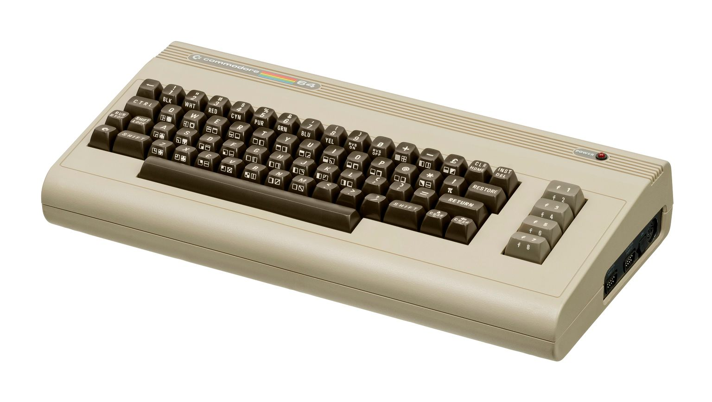

This core is based on the [MiSTer](https://github.com/MiSTer-devel/C64_MiSTer) Commodore 64 core which itself is based on the work of [many others](https://github.com/MJoergen/C64MEGA65/blob/master/AUTHORS).

[MJoergen](https://github.com/MJoergen) and [sy2002](http://www.sy2002.de) ported the core to the MEGA65 between 2022 and 2024.

The core uses the [MiSTer2MEGA65](https://github.com/sy2002/MiSTer2MEGA65)
framework and [QNICE-FPGA](https://github.com/sy2002/QNICE-FPGA) for FAT32 support (loading ROMs, mounting disks) and for the on-screen-menu.

## Current Version (5.2)

With our [Release 5.2](https://github.com/MJoergen/C64MEGA65/blob/master/VERSIONS.md), we are aiming for a complete **retro C64 PAL experience**: The core turns your MEGA65 into a Commodore 64 with a 1541 disk drive (you can mount `.d64` images from your SD Card). It also supports the following hardware ports of the MEGA65:

* Both Joystick ports for joysticks, mice and paddles
* Expansion port for C64 cartridges: Most physical Games, freezers, fast loader cartridges, GeoRAM, multi-function flash cartridges, work directly.
* IEC port so that you can attach real 1541 & 1581 drives as well as printers, plotters or modern devices such as the SD2IEC or the Pi1541.

Additionally, the C64 for MEGA65 core can simulate a 1750 REU with 512KB of RAM, it can simulate many cartridges (by loading `.crt` files) and it offers a Dual SID / Stereo SID experience.

The C64 runs the original Commodore Kernal and the 1541 runs the original
Commodore DOS, which leads to authentic loading speeds. You will be surprised 
how long you had to wait until the C64/1541 finished loading a game.

You can optionally [install JiffyDOS](jiffydos-and-alternative-kernals.html) or use physical/virtual fast loader cartridges to speed up loading.

You will be amazed by the 99.99% compatibility that this Core has when it comes to games, demos and other demanding C64 software. Most demos are even recognizing this Core as genuine C64 hardware. Common user scenarios like attaching a physical fast loader cartridge while connecting a genuine 1541 via IEC are working flawlessly.

### Earlier versions
If you want to know about the evolution of the C64 Core to its current state, you can see a complete version history on the Github: 

https://github.com/MJoergen/C64MEGA65/blob/master/VERSIONS.md

## Video and Audio

Our philosophy on the MEGA65's outputs is that VGA is the "pure" retro-output (and you can also switch it to 15 kHz and composite sync for a true retro feeling) while HDMI is the "processed" modern output. So there is no "processing" such as CRT emulation and other things on the VGA output, while on the HDMI output several algorithms are working for a very nice looking authentic image.

### HDMI

The core at default outputs 1280×720 pixels (720p) at 50 Hz and HDMI audio at a sampling rate of 48 kHz by default. This is supported by a vast majority of monitors and TVs. The 4:3 aspect ratio of the C64's output is preserved during upscaling, so that even though 720p is a 16:9 picture, the C64 looks pixel perfect and authentic on HDMI.

There are many options to optimize the HDMI-Display for your specific monitor, please see details on the [HDMI](hdmi-and-analog-output.html#hdmi-modes) page.

If you use a 4:3 or 5:4 display via HDMI then use the option "HDMI: 4:3 50 Hz" or HDMI: 5:4 50 Hz" respectively to activate "PAL over HDMI"; the core will output 720x576 pixels (576p) at 50 Hz.

### VGA

For a true retro feeling, we are providing a 4:3 image via the MEGA65's VGA port, so that you can connect real CRT monitors or older 4:3 LCD/TFT displays. The resolution is 720x576 pixels and the frequency is 50.125 Hz in PAL mode. If your monitor supports this, you will experience silky smooth scrolling without any flickering and tearing.

Retro 15 kHz RGB over VGA: This is for the ultimate retro experience: Connect an old SCART TV or an old RGB-capable monitor to MEGA65's VGA port. The core supports composite sync (CSYNC) so that SCART and other retro devices work flawlessly. Learn more in the dedicated documentation about [using analog retro cathode ray tubes](hdmi-and-analog-output#retro-15-khz-for-cathode-ray-tubes).
  
## Convenience features

* [On-Screen-Menu](the-main-menu.html) via the MEGA65's <kbd>Help</kbd> key
* Can mount `.d64` disk images from the SD card virtually (no real disk drive needed)
* Can load `.crt` cartridges (within limitations) from the SD card
* Can directly run `.prg` programs from the SD card.
* Realtime switching of Joystick ports 1 and 2.
* Realtime switching (without Reboot) between 6581/8580 mono SID and several stereo SID options.
* Realtime switching (without Reboot) between 6526 CIA and 8521 CIA.
* CRT filter: Optional visual scan lines via HDMI so that the output looks more like an old monitor or TV including authentic anti-aliasing.
* Crop/Zoom: On HDMI, you can optionally crop the top and bottom border of the C64's output and zoom in, so that the 16:9 screen real-estate is better utilized and you have a larger picture.
* Audio processing: Optionally improve the raw audio output of the system.
* Scale-down the OSM to accomodate the overscan of some analog retro cathode ray tubes.

## Constraints and missing features

Our Release 5.2 is a mature release. Thanks to all the folks who [contributed](https://github.com/MJoergen/C64MEGA65/blob/master/AUTHORS) to the Core, it is incredibly compatible to an original PAL Commodore 64. With our Release 5.2 you can play nearly all the available games and watch almost all demos ever written for the C64. You can plug nearly every classic hardware cartridge ever made for the C64 into the MEGA65's expansion port and enjoy working/playing with it and you can work with any IEC device (retro devices such as original 1541 or 1581 drives, printers, plotters and modern devices such as the SD2IEC).

Yet, at this moment, our MEGA65 version of the MiSTer core is still **missing**
some nice features such as:

* Use the MEGA65's physical drive as a C1581

* NTSC mode (different timings for CPU and VIC-II)

* Mounting tape images from SD Card (`.tap`)

* Mounting D81 disk images (`.d81`)

* Mounting G64 disk images (`.g64`)

* Formatting disk images (`.d64` and `.g64`)

And there is much more. Have a look at our [Roadmap](https://github.com/MJoergen/C64MEGA65/blob/master/ROADMAP.md) to learn what we plan to do in future.

**Please do not expect a Core update in 2025.**