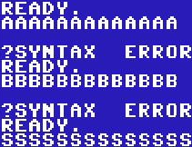
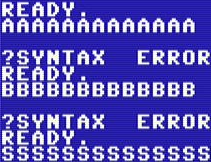

When you start the C64 core you see the standard C64 screen after about 2 seconds (5 seconds when you power cycle the machine). While you can just happily type C64 commands and use your MEGA65 like a C64, you might want to press the <kbd>Help</kbd> key (last of the function keys in the upper row) and go straight to the menu that shows you all functions of the Core. You also press <kbd>Help</kbd> again to close the menu. The C64 is not paused while in the menu.

Use the cursor keys to select options, <kbd>Return</kbd> to select an option and <kbd>Esc</kbd> to get back to a higher menu level or cancel a function.

We go through every option one by one in order of screen appearance. Please also use the bookmarks on the right side of this documentation.

Some of the menu options are on/off toggles. When there is a ``=`` character in front of an option, it is turned on. When there is a ``*`` character in front of an option, it is the selected item out of several options (all grouped together).

The <kbd>Run/Stop</kbd> key brings you up one menu level and closes the menu when you are on the top level. When you use <kbd>Help</kbd> to close the menu, and then to open it up again, it will return you to the level you were in.

## C64 for MEGA65
### 8: < Mount Drive >
Here you can select a ``.d64`` file on the current SD card which will be mounted as a disk in a virtual 1541. Currently only the ``.d64`` format is supported. Select a file or a directory with the cursor keys and <kbd>Return</kbd>. To unmount a disk you can press <kbd>Space</kbd>. For more keyboard functions, see [here](working-with-the-file-browser.html).
### PRG: < LOAD >
This allows you to directly load a ``.prg`` file from the SD card. This file is loaded directly into the RAM of the C64 and automatically started. This is usually many times faster than loading from a mounted disk, but does not allow loading additional parts, so only is useful for single programs. For more keyboard functions, see [here](working-with-the-file-browser.html).

Please make sure that no physical or virtual cartridge is plugged in when you use this option, as the C64 is reset when you select it and this would activate a cartridge - unless of course you exactly need that behaviour for example when your program requires a BASIC expansion cartridge.

## Expansion Slot
### Use Hardware Slot
You need to turn on this option to use a physical cartridge plugged into the cartridge port of the MEGA65. If it is turned on, all other options for the Expansion Port are turned off. There is a lot of information about cartridges [here](c64-cartridges.html).
### Simulate 1750 REU 512KB
This adds a virtual RAM expansion to your C64 Core. This should only be turned on if a specific program requires it. You can not use a physical 1750 REU. If the virtual 1750 REU is active, neither the cartridge port nor a virtual cartridge can be used.
### Simulate cartridge
This toggle turns the currently loaded virtual cartridge on or off. It has no function when the Hardware Slot is turned on or the virtual 1750 REU is activated.
### CRT : < LOAD >
This loads a ``.crt`` file from the SD card and virtually inserts it into the C64. The file needs to be in VICE 3.X format. Not all cartridge types are supported. More details can be found [here](c64-cartridges.html). For more keyboard functions, see [here](working-with-the-file-browser.html).
## C64 Configuration 
### Flip joystick ports
The C64 has two "Control Ports" numbered 1 and 2. Unfortunately most single-player games require the controller to be plugged into Port #2. To avoid constant un- and replugging, you can simply switch the to ports: 1 becomes 2 and 2 becomes 1. More details about controllers can be found [here](joysticks-paddles-mice.html).
### SID: XXXX (or) SID: L: XXXX R: YYYY
You can configure the soundchip used by the C64 Core (there are two options) and even have Pseudo-Stereo (two slightly different soundchips running in parallel) or, only in some demos, real Stereo with two soundchips. The full documentation can be found [here](audio-output-and-sid.html).
### CIA: Use 8521 (C64C)
The CIA chip in the C64 has had one subtle but visible change in the course of the C64 production. A very limited number of demos or games require the timing of the newer version if this chip. When this option is turned off, the Core runs the older version of this chip. If a modern demo does not run, make sure that you turned on this option but every game we encountered so far should run with this option turned off.
### IEC: Use Hardware Port
When you turn on this option, physical devices connect to the IEC port (the round plug), like a 1541 disk drive or a modern SD2IEC-device, can be accessed by the core. You can turn this off when connected devices impact a game and you do not want to switch them off. It is not needed to be turned off to use the virtual drive 8, but any drive 8 on the bus is then ignored. Switching this on or off during disk access can damage data. More details can be found [here](working-with-disks-and-drives.html#connecting-an-external-drive).
### Kernal: Standard
This menu allows you to switch the ROMs inside the C64 core to one of four different sets. Three of these are included:
* **Standard** is a standard PAL C64 Kernel without any special features.
* **Games System** is the ROM used inside the C64GS console. It is only needed for some C64GS cartridges that specifically check for this ROM.
* **Japanese** is a japanese version of the C64 ROM with changes for the japanese market that made the C64 incompatible with some software (so customers often changed back the ROMs to the US ones). For the odd case that a piece of software requires these ROMs, they are included.
* **JiffyDOS** turns on JiffyDOS *if you have installed it manually*. When it is not installed, the C64 core will just crash and show no picture if you select this. Please just switch back to the Standard setting. Find out more [here](jiffydos-and-alternative-kernals.html).

Changing the Kernal will reset the C64. 
## Display Settings
### HDMI: (Resolution)
In this menu you can choose one of the supported resolutions and more of the HDMI output. Please see the full section on videomodes [here](vga-and-hdmi-output.html). It contains important compatibility info, so please have a read.
### HDMI: CRT emulation
This turns on a basic emulation of the scanline look and fuzzy picture of a C64 back in the Eighties. It's actually recommended to keep this on. When off, you do get extremely sharp pixels, but there are aliasing artifacts that make it look like some pixels are thinner than others. Compare these two images, without and with CRT emulation:

 

### HDMI: Zoom-in
This option slightly zooms into the picture in some of the videomodes. Please find out more [here](vga-and-hdmi-output.html).
### VGA: Standard
This option switches between different VGA output modes. The standard mode should work with every current VGA monitor, but if you have a good old (heavy and deep) CRT you can go full retro here. Please find out more [here](vga-and-hdmi-output.html).
### OSM: 100%
If you have switched to a video mode that makes the menu too large for your screen, you can make it smaller here. This is not very sophisticated, but works. This might be changed in a later version of the Core.
## About & Help
Shows credits and slightly less info than the document you are currently reading.
## Close Menu
Closes the menu, if you do not want to press <kbd>Help</KBD> again, which also closes the menu.

