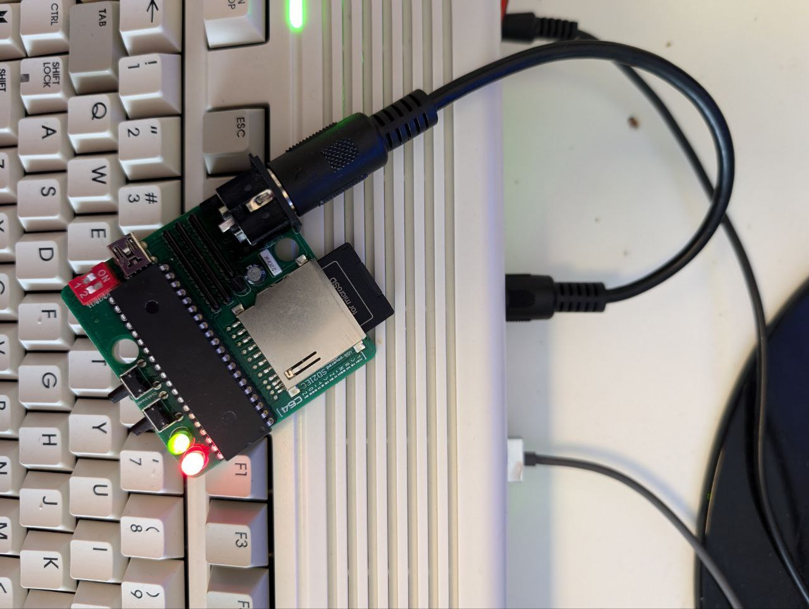
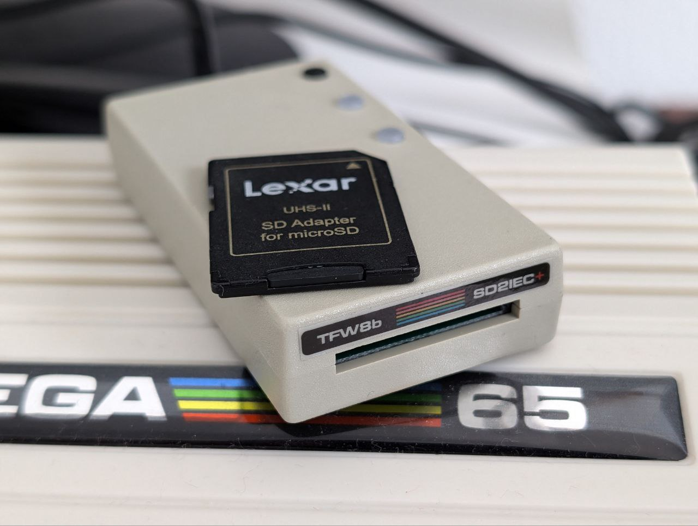

## The internal 1541 simulation (Mounted disks)

The C64 Core does come with an advanced implementation of the 1541 drive which can mount ``.d64`` images stored on your SD Card. It can not simulate other drives and it does not simulate GCR-encoded images in ``.g64`` format. This means that no heavily copy protected software will run when loaded as an image. Both 35 track and 40 track images are supported.

This "internal" 1541 drive always is device #8. This leads to conflicts when you connect a real 1541 (or similar) to the MEGA65 which is also a #8. Whenever you mount a ``.d64`` image, make sure that you have no #8 device connected (or turn off the IEC bus).

The C64 Core can only mount images that are already stored on the SD Card. If you think you will need an empty ``.d64`` image to save programs or games, you need to create them externally and put them on the SD Card first. For your convenience you can download an empty disk image [here](empty.d64).

### Formating disks

Currently the Core cannot format a simulated disk, i.e. a .d64 disk image. So something like

``OPEN1,8,15,"N:NAME,ID":CLOSE1``

will not work with the Core. Games that do format their own game disks (maybe for save games) with some own fancy format will not work. You need to supply an empty disk image as described above when a game or program wants to format this disk by itself.

### Using multi-disk programs

You can mount a new image at any time, so programs that come on multiple disks can be used. Just mount the image of the next disk or diskside when you are asked to switch disks by the program. The C64 Core does not support automount lists or playlists, you have do manually mount the disks from the <kbd>Help</kbd> menu.

### LED information of disk status / disk flush
The drive light of the MEGA65 shows you the current status of the mounted disk:

* LED off: No disk access
* LED green: The C64 is accessing the mounted disk
* LED blinking green rapidly: There has been an error when the C64 accessed the disk
* LED yellow: The MEGA65 is updating the ``.d64`` file currently mounted on the SD card.

It is important to know that there is a tiny delay between the C64 writing something to the disk and the ``.d64`` file on the SD card getting updated with the data written to the disk. This is why you will see the drive led quickly turn from green to yellow after the C64 is done with saving. This is the process of actually saving all the changes to the SD card. It happens seamlessly in the background, you do not need to do anything specific.

To prevent data corruption after saving something: **Never turn the MEGA65 off or remove the SD card while the led is green or, when saving, before the drive led turned yellow and went off afterwards.**

Sometimes the C64 saves things "in chunks" / "in batches", so that it might happen that you see the drive led being green, then yellow, then off and then green/yellow/off for a second or third time. Always give the system the time to settle down before you turn it off, reset it or remove the SD card.

If you or the running program did not save anything, then the drive LED should not turn yellow.

### Supported .d64 variations
The ``.d64`` format has been extended several times into the following variations that can only be differentiated by their filesize. The Core does only support 35 or 40 track images without an error map.

| Disk Type  | File Size   | Supported 
|:--------------:|:---------:|:---------------------
|35 track, no errors|174848| YES
|35 track, 683 error bytes|175531|no
|40 track, no errors|196608| YES
|40 track, 768 error bytes|197376|no
|42 track, no errors|205312|no
|42 track, 802 error bytes|206114|no

The Core will only load ``.d64`` files with either 174848 bytes or 196608 bytes correctly.

## Connecting an external drive

The MEGA65 has an IEC-Port for round plugs with six pins. You can directly connect ANY device that was built for the Commodore 64 and it should work as intended. This of course includes all revisions of the 1541 drive.

Additional extensions with extra cables (e.g. DolphinDOS) are not supported.

The drive LED of the MEGA65 will not light up when using external drives.

Please make sure that you do not mount a ``.d64`` image when you have a device with the #8 on the IEC bus.

### Ultimate 1541
The different versions of the Ultimate 1541 connect to both the IEC bus and the Extension Port as a cartridge for their functionality. As the cartridge part is not fully supported, you also can not use an Ultimate 1541 with the Core yet.

### SD2IEC and Pi1541
These modern solid-state replacements for 1541 drives are wide-spread and, in theory, fully supported. The hardware design for these devices is open source and the software can be downloaded free of charge. This has lead to many different small vendors building devices based on these designs.

During our testing with the MEGA65 we have found a number of devices that have less-than-ideal implementations of the IEC bus. This bus, a child of the late 1970s, works by constantly having 5 volts power on its lines that can be "pulled down" by a device on the bus. Roughly, instead of the device issuing a signal it takes away the signal. This is a cool solution to daisy-chain devices, so having a device 8, 9 and 10 on  the same wires and even able to use Y-cables to connect several devices.

But: You constantly power the lines of the bus with 5 Volts and the MEGA65 is really good in doing this. While the good old original hardware does not mind, some of modern IEC-devices show a phenomenom called "back powering". **Even if you do not connect them to power, they light up when you connect them to the IEC bus.**

In the picture above, the SD2IEC device is not connected to a power supply - the respective Mini USB socket is found between the keyboard keys 3 and E. Still it receives enough electrical power through the IEC bus that the LEDs light up. This should not happen.

We own several iterations of both the Pi1541 and SD2IEC that show this behaviour when connected to a R6 MEGA65 board. And even more important: Once a device shows being affected by this back-powering, it leads to further problems especially if you want several devices on the bus, with data transmission errors and sometimes even total crashes of the device.

We were unable to test every device combination and especially the multitude of SD2IEC devices in the market. *As of the beginning of August 2024, the only device that reliably worked and showed no back-power problem is the SD2IEC+ device from tfw8b.com.* We will expand this to other devices proven to work in the upcoming weeks.

 

**When you are using an SD2IEC or Pi1541 device, take the following advice:**
* Get a really good power supply. Do not take the four year old cheap phone charger still lying around.
* Test whether the device LEDs light up or flicker when you have disconnected power to the device but the MEGA65 turns on. If you see this effect, please test your device thoroughly to make sure data transfer is not affected.
* Do not connect more than one "modern" device to the IEC bus. Two or three classic drives are OK. Mixing and matching modern and classic device might have side effects.

This section will be updated after we have run more tests on more MEGA65. Please also send us your observations in the Discord channel.